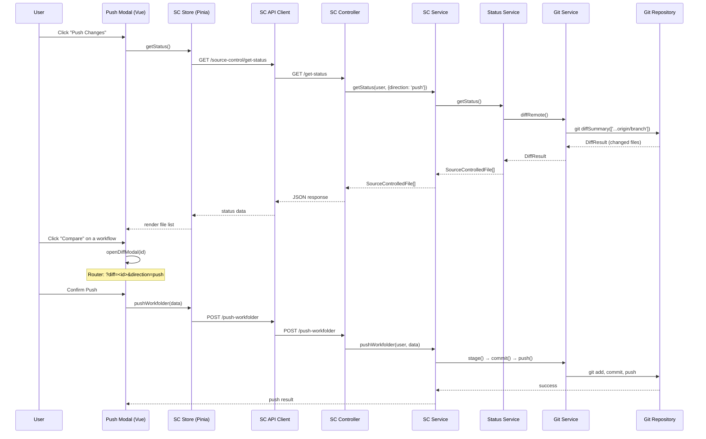
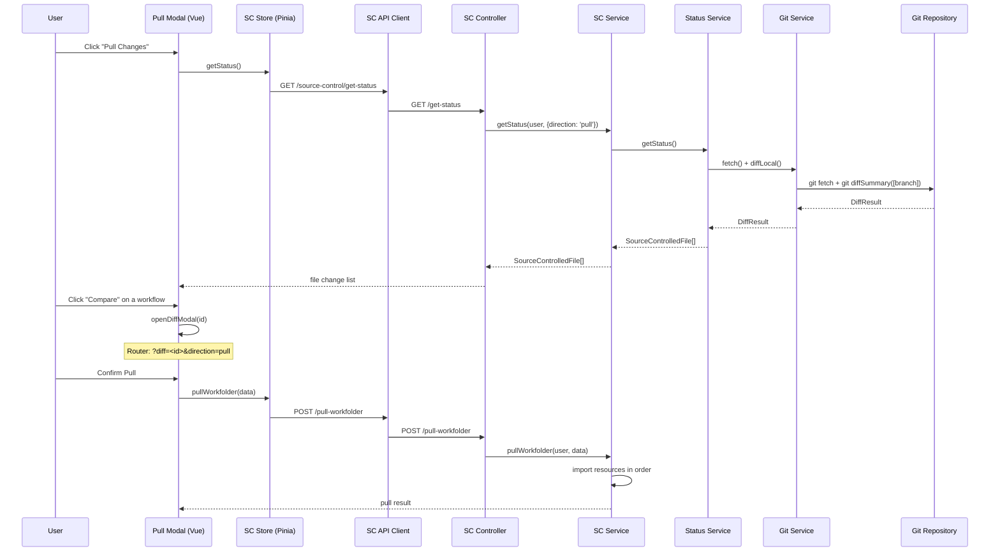

# Source Control Diff/Compare Architecture

This document provides a deep investigation of the git diff (compare) functionality
used in n8n's source control (Environments) feature. It covers the dependencies,
files, logic, and data flow for both push and pull operations to support
reproducing similar functionality on other web UIs.

## Table of Contents

- [Overview](#overview)
- [Architecture Diagram](#architecture-diagram)
- [Dependencies](#dependencies)
- [File Map](#file-map)
- [Backend: Git Diff Operations](#backend-git-diff-operations)
- [Backend: Status Comparison Logic](#backend-status-comparison-logic)
- [Backend: Push/Pull Orchestration](#backend-pushpull-orchestration)
- [Backend: API Endpoints](#backend-api-endpoints)
- [Core: Workflow Diff Utilities](#core-workflow-diff-utilities)
- [Frontend: Workflow Diff UI](#frontend-workflow-diff-ui)
- [Frontend: Source Control Store & API](#frontend-source-control-store--api)
- [Frontend: Push/Pull Modals & Routing](#frontend-pushpull-modals--routing)
- [Data Flow: Push Operation](#data-flow-push-operation)
- [Data Flow: Pull Operation](#data-flow-pull-operation)
- [Reproducing on Other Web UIs](#reproducing-on-other-web-uis)

---

## Overview

n8n's source control feature ("Environments") allows enterprise users to synchronize
multiple n8n deployments via a shared git repository. The diff/compare functionality
enables users to see what has changed between their local instance and the remote
git repository before pushing or pulling changes.

The system operates at two levels:

1. **Git-level diff** — Uses `simple-git` to detect which files changed in the git
   repository (file-level diffing).
2. **Semantic-level diff** — Compares workflow nodes, connections, credentials, tags,
   folders, and variables by their semantic properties (content-level diffing).

---

## Architecture Diagram

```mermaid
graph TB
    subgraph Frontend["Frontend (Vue 3 + Pinia)"]
        PushModal["SourceControlPushModal.vue"]
        PullModal["SourceControlPullModal.vue"]
        DiffModal["WorkflowDiffModal.vue"]
        DiffRouting["useWorkflowDiffRouting.ts"]
        DiffComposable["useWorkflowDiff.ts"]
        SCStore["sourceControl.store.ts"]
        SCApi["sourceControl.api.ts"]
        
        PushModal -->|"openDiffModal()"| DiffRouting
        PullModal -->|"openDiffModal()"| DiffRouting
        DiffRouting -->|"route query params"| DiffModal
        DiffModal -->|"uses"| DiffComposable
        PushModal --> SCStore
        PullModal --> SCStore
        SCStore --> SCApi
    end

    subgraph Core["Core (n8n-workflow package)"]
        WFDiff["workflow-diff.ts"]
        ConnDiff["connections-diff.ts"]
        
        WFDiff -->|"uses"| ConnDiff
    end

    subgraph Backend["Backend (CLI package)"]
        Controller["source-control.controller.ee.ts"]
        Service["source-control.service.ee.ts"]
        StatusSvc["source-control-status.service.ee.ts"]
        GitSvc["source-control-git.service.ee.ts"]
        Helper["source-control-helper.ee.ts"]
        ExportSvc["source-control-export.service.ee.ts"]
        ImportSvc["source-control-import.service.ee.ts"]
        
        Controller --> Service
        Service --> StatusSvc
        Service --> GitSvc
        Service --> ExportSvc
        Service --> ImportSvc
        StatusSvc --> GitSvc
        Service --> Helper
    end

    subgraph External["External"]
        SimpleGit["simple-git (npm)"]
        GitRepo["Git Repository"]
    end

    SCApi -->|"REST API"| Controller
    DiffComposable -->|"imports"| WFDiff
    GitSvc -->|"uses"| SimpleGit
    SimpleGit -->|"git operations"| GitRepo
```



---

## Dependencies

### Backend (packages/cli)

| Dependency | Version | Purpose |
|------------|---------|---------|
| `simple-git` | 3.28.0 | Git operations (clone, diff, push, pull, commit, status) |
| `json-diff` | 1.0.6 | JSON-level diffing for credential/variable comparison |
| `lodash` | catalog | Deep comparison (`isEqual`), object picking (`pick`) |

### Core (packages/workflow)

| Dependency | Version | Purpose |
|------------|---------|---------|
| `lodash` | catalog | `isEqual` for deep comparison, `pick` for property selection |

### Frontend (packages/frontend/editor-ui)

| Dependency | Version | Purpose |
|------------|---------|---------|
| `vue` | 3.x | Reactive UI framework |
| `pinia` | catalog | State management for source control store |
| `vue-router` | catalog | URL-based routing for diff modal navigation |

---

## File Map

### Backend — Git & Source Control Services

```
packages/cli/src/modules/source-control.ee/
├── source-control-git.service.ee.ts      # Core git operations via simple-git
├── source-control.service.ee.ts          # Push/pull orchestration
├── source-control-status.service.ee.ts   # Semantic status comparison
├── source-control.controller.ee.ts       # REST API endpoints
├── source-control-helper.ee.ts           # Utility functions (paths, tracking, validation)
├── source-control-export.service.ee.ts   # Export workflows/assets to git files
├── source-control-import.service.ee.ts   # Import workflows/assets from git files
├── source-control-preferences.service.ee.ts  # Configuration management
├── source-control-resource-helper.ts     # Resource filtering utilities
├── source-control-scoped.service.ts      # Scoped operations per project
├── source-control.config.ts              # Config schema
├── source-control.module.ts              # Module registration
├── constants.ts                          # Constant values
├── middleware/
│   └── source-control-enabled-middleware.ee.ts  # Auth middleware
├── types/                                # TypeScript type definitions
│   ├── exportable-workflow.ts
│   ├── exportable-credential.ts
│   ├── exportable-tags.ts
│   ├── exportable-folders.ts
│   ├── exportable-project.ts
│   ├── exportable-variable.ts
│   ├── source-control-get-status.ts
│   ├── source-control-push.ts
│   ├── source-control-commit.ts
│   ├── source-control-stage.ts
│   ├── source-control-context.ts
│   ├── source-control-preferences.ts
│   └── ... (other types)
└── __tests__/
    ├── source-control-git.service.test.ts
    ├── source-control.service.test.ts
    ├── source-control-status.service.test.ts
    ├── source-control-helper.ee.test.ts
    ├── source-control-export.service.test.ts
    ├── source-control-import.service.ee.test.ts
    ├── source-control-preferences.service.ee.test.ts
    └── source-control.controller.ee.test.ts
```

### Core — Workflow Diff Utilities

```
packages/workflow/src/
├── workflow-diff.ts                      # Node comparison & merge rules
└── connections-diff.ts                   # Connection comparison

packages/workflow/test/
├── workflow-diff.test.ts
└── connections-diff.test.ts
```

### Frontend — Workflow Diff UI

```
packages/frontend/editor-ui/src/features/workflows/workflowDiff/
├── WorkflowDiffModal.vue                 # Main diff modal (side-by-side view)
├── WorkflowDiffAside.vue                 # Side panel for node details
├── NodeDiff.vue                          # Node-level property diff display
├── DiffBadge.vue                         # Status badges (added/deleted/modified)
├── SyncedWorkflowCanvas.vue              # Dual-canvas synchronized view
├── HighlightedEdge.vue                   # Visual highlighting for changed edges
├── useWorkflowDiff.ts                    # Core diff composable
├── useViewportSync.ts                    # Canvas viewport synchronization
├── WorkflowDiffModal.test.ts
├── useWorkflowDiff.test.ts
├── useViewportSync.test.ts
├── NodeDiff.test.ts
├── HighlightedEdge.test.ts
└── DiffBadge.test.ts
```

### Frontend — Source Control Integration

```
packages/frontend/editor-ui/src/features/integrations/sourceControl.ee/
├── sourceControl.store.ts                # Pinia store for SC state
├── sourceControl.api.ts                  # REST API client
├── sourceControl.types.ts                # Frontend type definitions
├── sourceControl.utils.ts                # Utility functions
├── sourceControl.constants.ts            # Constants
├── sourceControl.eventBus.ts             # Event bus for SC events
├── components/
│   ├── SourceControlPushModal.vue        # Push changes modal with diff link
│   ├── SourceControlPullModal.vue        # Pull changes modal with diff link
│   └── SourceControlInitializationErrorMessage.vue
├── views/
│   └── SettingsSourceControl.vue         # Settings page for SC configuration
└── (test files)

packages/frontend/editor-ui/src/app/composables/
├── useWorkflowDiffRouting.ts             # Route-based diff modal management
└── useWorkflowDiffRouting.test.ts
```

---

## Backend: Git Diff Operations

### Source: `source-control-git.service.ee.ts`

This service wraps the `simple-git` library to perform all git operations. The key
diff-related methods are:

#### `diffRemote()` — Compare local with remote

```typescript
async diffRemote(): Promise<DiffResult | undefined> {
    const currentBranch = await this.getCurrentBranch();
    if (currentBranch.remote) {
        const target = currentBranch.remote;
        // Three-dot diff: shows changes since branches diverged
        return await this.git.diffSummary(['...' + target, '--ignore-all-space']);
    }
}
```

**Key details:**
- Uses three-dot diff (`...origin/branch`) to compare against the merge base
- `--ignore-all-space` flag ignores whitespace-only changes
- Returns `DiffResult` from `simple-git` containing changed files list

#### `diffLocal()` — Compare working directory

```typescript
async diffLocal(): Promise<DiffResult | undefined> {
    const currentBranch = await this.getCurrentBranch();
    if (currentBranch.remote) {
        const target = currentBranch.current;
        return await this.git.diffSummary([target, '--ignore-all-space']);
    }
}
```

**Key details:**
- Uses single branch name (working directory vs committed state)
- Also uses `--ignore-all-space` flag

#### Other Git Operations Used in Diff Flow

| Method | Purpose |
|--------|---------|
| `fetch()` | Fetch latest changes from remote before comparing |
| `status()` | Get working directory status (modified/untracked/deleted files) |
| `stage(files)` | Stage files before committing |
| `commit(message)` | Create a commit |
| `push(options)` | Push to remote |
| `pull(options)` | Pull from remote |

---

## Backend: Status Comparison Logic

### Source: `source-control-status.service.ee.ts`

The status service performs **semantic comparison** of resources rather than
raw file diffing. It compares six resource types:

#### Comparison Algorithm

For each resource type, the service follows this pattern:

1. **Load local items** from the database
2. **Load remote items** from git-exported JSON files
3. **Compare by ID** to find:
   - Items **missing in local** (exist in remote only → need to pull)
   - Items **missing in remote** (exist in local only → need to push)
   - Items **present in both** (need property-level comparison)
4. **Compare properties** to detect modifications:
   - Workflows: compared by `versionId`
   - Credentials: compared by `name` and `type`
   - Variables: compared by `key`
   - Tags: compared by `name` and mappings
   - Folders: compared by `parentId` and owner
   - Projects: compared by name and type

#### Result Type: `SourceControlledFile`

```typescript
interface SourceControlledFile {
    file: string;          // File path in git repo
    id: string;            // Resource ID
    name: string;          // Resource name
    type: string;          // 'workflow' | 'credential' | 'variable' | 'tag' | 'folder' | 'project'
    status: string;        // 'created' | 'modified' | 'deleted'
    location: string;      // 'local' | 'remote'
    conflict: boolean;     // Whether there's a conflict
    updatedAt: string;     // Last update timestamp
}
```

---

## Backend: Push/Pull Orchestration

### Source: `source-control.service.ee.ts`

#### Push Flow (`pushWorkfolder`)

```
1. Call getStatus(direction='push') → SourceControlledFile[]
2. Filter files by allowed resources
3. Check for conflicts → return 409 if conflicts and not forced
4. Export resources to git files:
   - Workflows → JSON files
   - Credentials → JSON files (stripped of sensitive data)
   - Variables → JSON file
   - Tags → JSON file
   - Folders → JSON file
5. Stage changed files (git add)
6. Commit with user's message (git commit)
7. Push to remote (git push)
8. Return push result + status
```

#### Pull Flow (`pullWorkfolder`)

```
1. Call getStatus(direction='pull') → SourceControlledFile[]
2. Check for conflicts → return 409 if conflicts
3. Import resources from git files in order:
   a. Projects
   b. Folders
   c. Workflows
   d. Credentials
   e. Tags
   f. Variables
4. Delete resources that are missing in remote
5. Return status result
```

---

## Backend: API Endpoints

### Source: `source-control.controller.ee.ts`

| Method | Endpoint | Description |
|--------|----------|-------------|
| `GET` | `/source-control/get-status` | Get status of all changes (with optional direction) |
| `GET` | `/source-control/status` | Alias for get-status |
| `POST` | `/source-control/push-workfolder` | Push local changes to remote |
| `POST` | `/source-control/pull-workfolder` | Pull remote changes to local |
| `GET` | `/source-control/preferences` | Get source control preferences |
| `POST` | `/source-control/preferences` | Save source control preferences |
| `PATCH` | `/source-control/preferences` | Update source control preferences |
| `GET` | `/source-control/remote-workflow` | Get specific remote workflow (for diff view) |
| `POST` | `/source-control/generate-key-pair` | Generate SSH key pair |
| `POST` | `/source-control/disconnect` | Disconnect from git repo |

---

## Core: Workflow Diff Utilities

### Source: `packages/workflow/src/workflow-diff.ts`

#### `compareWorkflowsNodes(base, target)` — Compare Node Arrays

```typescript
function compareWorkflowsNodes<T extends DiffableNode>(
    base: T[],
    target: T[],
    nodesEqual?: (base: T, target: T) => boolean
): WorkflowDiff<T>
```

**Algorithm:**
1. Index both arrays into `Map<nodeId, node>`
2. For each node in `base`:
   - If not in `target` → status: **Deleted**
   - If in `target` but not equal → status: **Modified**
   - If in `target` and equal → status: **Equal**
3. For each node in `target`:
   - If not in `base` → status: **Added**

**Node equality** (`compareNodes`) compares these properties:
- `name`, `type`, `typeVersion`, `webhookId`, `credentials`, `parameters`
- Uses `lodash/pick` + `lodash/isEqual` for deep comparison
- **Excludes** position data (moving a node is not a meaningful change)

#### Node Diff Status Enum

```typescript
enum NodeDiffStatus {
    Eq = 'equal',
    Modified = 'modified',
    Added = 'added',
    Deleted = 'deleted',
}
```

### Source: `packages/workflow/src/connections-diff.ts`

#### `compareConnections(prev, next)` — Compare Connection Maps

```typescript
function compareConnections(prev: IConnections, next: IConnections): ConnectionsDiff
```

**Algorithm:**
1. Collect all unique node names from both connection objects
2. For each node, collect all unique input names
3. For each input, compare connections at each source index:
   - Serialize connections to JSON strings for comparison
   - Connections in `next` but not in `prev` → **added**
   - Connections in `prev` but not in `next` → **removed**

### `WorkflowChangeSet` — Combined Diff

```typescript
class WorkflowChangeSet<T extends DiffableNode> {
    readonly nodes: WorkflowDiff<T>;        // Map<nodeId, {status, node}>
    readonly connections: ConnectionsDiff;   // {added, removed}

    constructor(from: DiffableWorkflow<T>, to: DiffableWorkflow<T>)
}
```

### Additional Utility Functions

| Function | Purpose |
|----------|---------|
| `hasNonPositionalChanges(oldNodes, newNodes, oldConns, newConns)` | Checks if workflows differ beyond just node positions |
| `hasCredentialChanges(oldNodes, newNodes)` | Detects credential additions/removals/changes |
| `groupWorkflows(workflows, rules, skipRules)` | Groups workflow versions for merge/collapse |
| `determineNodeSize(parameters)` | Estimates node complexity for merge decisions |

---

## Frontend: Workflow Diff UI

### `useWorkflowDiff.ts` — Core Diff Composable

This Vue composable orchestrates the comparison of two workflow versions:

```typescript
function useWorkflowDiff(
    sourceWorkflow: Ref<DiffableWorkflow>,
    targetWorkflow: Ref<DiffableWorkflow>
) {
    // Returns:
    nodesDiff: ComputedRef<WorkflowDiff>      // Node-level diff results
    connectionsDiff: ComputedRef<...>          // Connection-level diff results
}
```

**Logic:**
1. Maps both workflows to canvas-compatible format
2. Calls `compareWorkflowsNodes()` from `n8n-workflow` package
3. Compares connections using Set difference operations
4. Returns structured diff with status labels for UI rendering

### `WorkflowDiffModal.vue` — Main Diff View

The modal displays a side-by-side comparison with:

- **Dual canvas view** — Two synchronized workflow canvases showing the
  local version and remote version
- **Three tabs:**
  - **Nodes** — Lists all nodes with change count badge
  - **Connectors** — Lists changed connections
  - **Settings** — Shows workflow setting differences
- **Visual indicators:**
  - Green highlighting for added nodes/connections
  - Red highlighting for deleted nodes/connections
  - Yellow/orange highlighting for modified nodes
  - Neutral styling for unchanged elements
- **Detail panel** — Clicking a modified node shows a JSON-level property
  diff in a side panel
- **Navigation** — Previous/Next buttons to cycle through changes
- **Viewport sync** — Scrolling one canvas scrolls both

### `useViewportSync.ts` — Canvas Synchronization

Keeps the two side-by-side canvases in sync so scrolling or zooming one
canvas automatically updates the other.

### Component Hierarchy

```
WorkflowDiffModal.vue
├── SyncedWorkflowCanvas.vue (x2 — source & target)
│   ├── HighlightedEdge.vue (per changed connection)
│   └── DiffBadge.vue (per node with changes)
├── WorkflowDiffAside.vue (detail panel)
│   └── NodeDiff.vue (per-property diff display)
└── useWorkflowDiff.ts (diff computation)
    └── useViewportSync.ts (scroll sync)
```

---

## Frontend: Source Control Store & API

### `sourceControl.store.ts` — Pinia Store

Key actions related to diff:

| Action | Description |
|--------|-------------|
| `getStatus()` | Fetch file change status from backend |
| `getAggregatedStatus()` | Fetch aggregated status |
| `getRemoteWorkflow(id)` | Fetch a specific remote workflow for diff comparison |
| `pushWorkfolder(data)` | Push changes to remote |
| `pullWorkfolder(data)` | Pull changes from remote |

### `sourceControl.api.ts` — REST API Client

| Function | HTTP Method | Endpoint |
|----------|-------------|----------|
| `pushWorkfolder(ctx, data)` | POST | `/source-control/push-workfolder` |
| `pullWorkfolder(ctx, data)` | POST | `/source-control/pull-workfolder` |
| `getStatus(ctx, data)` | GET | `/source-control/get-status` |
| `getAggregatedStatus(ctx)` | GET | `/source-control/status` |
| `getRemoteWorkflow(ctx, id)` | GET | `/source-control/remote-workflow` |

---

## Frontend: Push/Pull Modals & Routing

### Push Modal (`SourceControlPushModal.vue`)

- Displays a list of locally changed files (workflows, credentials, etc.)
- Each workflow item has a **"Compare"** button that opens the diff modal
- The compare button calls `openDiffModal(id)` which uses Vue Router:
  ```typescript
  router.push({ query: { diff: id, direction: 'push', workflowStatus: status } })
  ```

### Pull Modal (`SourceControlPullModal.vue`)

- Displays a list of remotely changed files to be pulled
- Each workflow item has a **"Compare"** button
- Works the same as push modal but with `direction: 'pull'`

### Routing (`useWorkflowDiffRouting.ts`)

Manages modal lifecycle via URL query parameters:

| Query Parameter | Purpose |
|----------------|---------|
| `sourceControl` | `'push'` or `'pull'` — which parent modal to open |
| `diff` | Workflow ID — opens the diff modal for that workflow |
| `direction` | `'push'` or `'pull'` — indicates the context |
| `workflowStatus` | File status passed to the diff view |

**Navigation flow:**
```
Push/Pull Modal → (click Compare) → URL adds ?diff=<id>&direction=push
    → Diff Modal opens → (click Back) → URL removes diff param
    → Push/Pull Modal reopens with preserved state
```

---

## Data Flow: Push Operation



---

## Data Flow: Pull Operation



---

## Reproducing on Other Web UIs

To reproduce n8n's diff/compare functionality on another web UI, implement
these layers:

### 1. Git Operations Layer

**Required dependency:** [`simple-git`](https://github.com/steveukx/git-js) (v3.28.0)

```typescript
// Core operations needed
const git = simpleGit(repoPath);

// Fetch latest from remote
await git.fetch();

// Get changed files (push context — local vs remote)
const pushDiff = await git.diffSummary(['...origin/branch', '--ignore-all-space']);

// Get changed files (pull context — remote vs local)
const pullDiff = await git.diffSummary(['branch', '--ignore-all-space']);

// Get working directory status
const status = await git.status();
```

### 2. Semantic Comparison Layer

Compare resources by their meaningful properties rather than raw file content:

```typescript
// Node comparison: compare by functional properties, ignore position
const propsToCompare = ['name', 'type', 'typeVersion', 'webhookId', 'credentials', 'parameters'];
const isEqual = lodash.isEqual(pick(nodeA, propsToCompare), pick(nodeB, propsToCompare));

// Status determination: create/modified/deleted by comparing ID maps
const baseMap = new Map(baseItems.map(item => [item.id, item]));
const targetMap = new Map(targetItems.map(item => [item.id, item]));

for (const [id, item] of baseMap) {
    if (!targetMap.has(id)) status = 'deleted';
    else if (!deepEqual(item, targetMap.get(id))) status = 'modified';
    else status = 'equal';
}
for (const [id, item] of targetMap) {
    if (!baseMap.has(id)) status = 'added';
}
```

### 3. UI Diff Display Layer

Key components to implement:

1. **File change list** — Show modified/added/deleted resources with status badges
2. **Side-by-side canvas** — Render two versions of the workflow graph simultaneously
3. **Node detail diff** — Show property-level JSON diff for modified nodes
4. **Viewport synchronization** — Keep both canvases aligned when scrolling/zooming
5. **Navigation** — Previous/Next buttons to cycle through changes
6. **Route-based modal management** — Use URL query parameters for browser
   back/forward support

### 4. Key Design Decisions

| Decision | Rationale |
|----------|-----------|
| Three-dot diff for push | Shows only divergent changes, not full history |
| Ignore whitespace in git diff | Avoids false positives from formatting |
| Compare by semantic properties, not file hash | Detects meaningful changes vs noise |
| Exclude position from node comparison | Moving nodes visually isn't a logical change |
| Use Map<id, item> for comparison | O(n) comparison instead of O(n²) |
| URL-based modal routing | Enables browser back/forward navigation |
| Synchronized dual canvas | Easier visual comparison for users |
